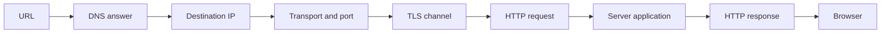

# Chapter 4: The Internet, web and application programming interfaces

A browser or service call may look like one operation, but it crosses several boundaries with different responsibilities. Names are resolved, packets move between networks, a transport carries data, security protects a channel, protocols give messages meaning and application code decides what those messages do.

This chapter assumes only the computing, programming and engineering ideas introduced in [Chapters 1–3](../README.md#map-of-the-territory). Each entry stands alone, while the chapter as a whole follows one request from an address to a response and then examines the contracts, state and compatibility concerns built on top.

The focus is communication mechanics. Distributed coordination and partial failure belong in Chapter 6, deployment infrastructure in Chapter 7, attacks and detailed defences in Chapter 9, and usability and accessibility outcomes in Chapter 10.

## Chapter map

The first pass covers:

1. [The Internet, Internet Protocol, transport, ports and the journey of a request](#the-internet-internet-protocol-transport-ports-and-the-journey-of-a-request)
2. [Domain Name System, domain names, Uniform Resource Locators and Uniform Resource Identifiers](#domain-name-system-domain-names-uniform-resource-locators-and-uniform-resource-identifiers)
3. [Hypertext Transfer Protocol, Hypertext Transfer Protocol Secure, Transport Layer Security and certificates](#hypertext-transfer-protocol-hypertext-transfer-protocol-secure-transport-layer-security-and-certificates)
4. [Browsers, semantic Hypertext Markup Language, Cascading Style Sheets and JavaScript](#browsers-semantic-hypertext-markup-language-cascading-style-sheets-and-javascript)
5. [Client-server systems, network service application programming interfaces and behavioural contracts](#client-server-systems-network-service-application-programming-interfaces-and-behavioural-contracts)
6. [Cookies, sessions, browser origins and Cross-Origin Resource Sharing](#cookies-sessions-browser-origins-and-cross-origin-resource-sharing)
7. [Progressive enhancement, capability detection and browser compatibility](#progressive-enhancement-capability-detection-and-browser-compatibility)

## The Internet, Internet Protocol, transport, ports and the journey of a request

*A remote operation passes through layers that can succeed or fail independently.*

### What they are

The **Internet** is a network of interconnected networks. The Web is one use of the Internet, not a synonym for it. The **Internet Protocol (IP)** uses network addresses to carry packets towards a destination. Routers forward those packets between networks, but IP does not promise that they arrive once, in order or at all.

A **transport protocol** carries application data between endpoints. The Transmission Control Protocol (TCP) provides a reliable, ordered stream of bytes while a connection lasts. It retransmits lost data, but it does not know whether a payment, login or other application operation succeeded. The User Datagram Protocol (UDP) provides independent messages called datagrams with fewer built-in guarantees; applications can add the properties they need. HTTP/3, for example, uses QUIC over UDP rather than TCP.

A **port** is a number that helps the destination operating system direct traffic to a service. Port `443` is the default for secure web traffic, but the number neither identifies the program with certainty nor makes its traffic safe.

One deliberately simplified request journey looks like this:



The client interprets an address, may resolve a name, reaches an endpoint, protects the connection when required, and exchanges protocol messages with an application. This is a responsibility map, not a literal trace of every request: answers can be cached, connections reused, intermediaries can respond and HTTP/3 does not use TCP.

### Why a builder needs to know this

“The site is down” can describe a name-resolution failure, unreachable route, refused connection, failed security negotiation, rejected request, application error or browser rejection. Naming the layer narrows diagnosis. It also explains why a remote call differs from a local function: it adds [latency](01-computing-foundations.md#latency-and-throughput), another machine and uncertainty about what completed.

### Pitfalls

- **“Every request performs DNS, then TCP, then TLS from scratch.”** Caches, reused connections, proxies and HTTP/3 all change that sequence.
- **“TCP success means application success.”** TCP transports bytes; it does not validate their business meaning or prove the server completed an operation.
- **“Port 443 proves the service is safe.”** A port is routing information, not authentication or approval.
- **“Packets always follow one fixed route.”** Routes can change, and no layer guarantees that every available path will be found.

### Related concepts in TFB

- [Operating systems and running programs](01-computing-foundations.md#operating-systems-and-running-programs) - the operating system connects incoming traffic to running services.
- [Errors, exceptions and cleanup](02-programming-foundations.md#errors-exceptions-and-cleanup) - network operations require honest failure and resource ownership.
- [Debugging and diagnosis](02-programming-foundations.md#debugging-and-diagnosis) - each layer supplies different evidence about a symptom.

### Deeper concepts

- Routing and network address translation - how addresses and paths work beyond this first model.
- QUIC and transport trade-offs - how applications obtain reliable streams without TCP.
- Packet capture - observing network traffic while respecting security and privacy boundaries.

### Further reading

- [RFC 8200: Internet Protocol, Version 6](https://www.rfc-editor.org/rfc/rfc8200.html) - the current IPv6 packet and forwarding model.
- [RFC 9293: Transmission Control Protocol](https://www.rfc-editor.org/rfc/rfc9293.html) - the maintained TCP specification and its service model.
- [Internet Assigned Numbers Authority port registry](https://www.iana.org/assignments/service-names-port-numbers/service-names-port-numbers.xhtml) - registered port ranges and their limits.
- [MDN: How the web works](https://developer.mozilla.org/en-US/docs/Learn_web_development/Getting_started/Web_standards/How_the_web_works) - an accessible request overview from a documentation project, rather than a protocol standard.

## Domain Name System, domain names, Uniform Resource Locators and Uniform Resource Identifiers

*A human-readable address, a name-system answer and a complete resource address are related but different things.*

### What they are

The **Domain Name System (DNS)** is a distributed, hierarchical system for information associated with domain names. A resolver asks name servers for records and may reuse a cached answer until its permitted lifetime expires. Address records can map a host name to one or more IP addresses, but DNS also carries other kinds of information. It answers questions about names, not complete web addresses.

A **domain name** is a name in that hierarchy. Registering one, hosting its DNS records, issuing its certificate and running its web service are separate responsibilities, even when one supplier sells all four.

A **Uniform Resource Locator (URL)** identifies how to access a resource. Consider:

`https://api.example.com:8443/v1/widgets?limit=20#results`

- `https` is the scheme;
- `api.example.com` is the host name;
- `8443` is an explicit port;
- `/v1/widgets` is the path;
- `limit=20` is the query; and
- `results` is the fragment, which a browser interprets rather than sending in the normal HTTP request.

The broader standards term **Uniform Resource Identifier (URI)** is useful for recognition, but most builders can use the operational term URL without debating the whole taxonomy. Browsers follow the maintained WHATWG URL parsing rules; RFC 3986 supplies the broader URI syntax and terminology.

### Why a builder needs to know this

These distinctions make configuration failures less mysterious. Buying a domain does not configure DNS; correct DNS does not deploy a server; and a working home page says nothing about another path. Cached answers also mean that a DNS change may not become visible to every resolver at once.

URL components affect routing, redirects, cache keys and security decisions. Use a standards-aware URL parser or builder rather than joining strings and guessing about escaping.

### Pitfalls

- **“DNS is one global spreadsheet.”** It is distributed and hierarchical, with caches and delegated authority.
- **“DNS success means the service works.”** It means a resolver produced an answer, not that the endpoint is reachable or healthy.
- **“A domain name, URL and browser origin are interchangeable.”** Each describes a different boundary.
- **“Percent-encoding encrypts or validates input.”** It only represents characters in a URL-compatible form.
- **“URLs are case-insensitive.”** DNS names normally ignore case, while paths and other components can follow different rules.

### Related concepts in TFB

- [Text, Unicode and character encodings](01-computing-foundations.md#text-unicode-and-character-encodings) - URLs are text with defined parsing and encoding rules.
- [Time, clocks, dates and time zones](01-computing-foundations.md#time-clocks-dates-and-time-zones) - cached DNS records have lifetimes.
- [Abstraction, information hiding and interfaces](03-software-engineering.md#abstraction-information-hiding-and-interfaces) - a stable name hides the current network destination only within stated limits.

### Deeper concepts

- DNS record types and delegation - the records and authority chain behind resolver answers.
- Internationalised domain names - representing names that contain non-ASCII characters.
- Registrars, registries and authoritative DNS hosting - distinct roles in managing a domain.

### Further reading

- [RFC 1034: Domain names—concepts and facilities](https://www.rfc-editor.org/rfc/rfc1034.html) - the original DNS architecture and terminology.
- [RFC 3986: URI Generic Syntax](https://www.rfc-editor.org/rfc/rfc3986.html) - the general component model behind URIs.
- [WHATWG URL Living Standard](https://url.spec.whatwg.org/) - the maintained browser URL parsing standard.
- [Internet Assigned Numbers Authority functions: About](https://www.iana.org/about) - the functions' current registry and Internet-identifier responsibilities, reviewed 2026-07-18.

## Hypertext Transfer Protocol, Hypertext Transfer Protocol Secure, Transport Layer Security and certificates

*HTTP gives requests and responses meaning; HTTPS protects their journey across a verified channel.*

### What they are

The **Hypertext Transfer Protocol (HTTP)** defines request and response semantics. A client sends a method, target, fields and sometimes content; a server returns a status, fields and sometimes content. HTTP is described as stateless because each request has its own meaning. An application can still keep user or business state elsewhere.

The current HTTP versions share these meanings but use different wire formats and transports. The following is a semantic sketch, not a complete HTTP/2 transcript:

```text
GET /products/42 HTTP/2
Host: shop.example

HTTP/2 200
Content-Type: text/html; charset=utf-8

<html>...</html>
```

**Hypertext Transfer Protocol Secure (HTTPS)** is HTTP exchanged through a protected channel. **Transport Layer Security (TLS)** checks that the server is authorised for the requested name, encrypts the channel and protects messages against undetected alteration in transit. In ordinary public HTTPS, the server presents a certificate that connects names to a public key through a chain the client is configured to trust. Certificate checks include the name and validity period, which is one reason incorrect clocks can break connections.

TLS may end at a reverse proxy or content delivery network before another connection reaches the application. Each later hop has its own protection and trust arrangement.

### Why a builder needs to know this

HTTP errors and TLS failures belong to different layers. A valid certificate can coexist with a broken application, and a `200` response can carry the wrong business result. Knowing the boundary helps you investigate certificate renewal, proxy configuration, protocol errors and application behaviour without treating the browser lock icon as a verdict on the whole system.

### Pitfalls

- **“HTTPS proves that a site or business is honest.”** It authenticates the service for a name and protects traffic in transit; it does not judge content or intent.
- **“A successful status proves the intended operation succeeded.”** It reports the response selected by the server, not independent correctness evidence.
- **“Stateless HTTP means the application stores no state.”** Sessions can reconnect otherwise independent requests.
- **“HTTPS protects data everywhere.”** Endpoint code, logs, storage and later network hops require separate controls.
- **“HTTP is always readable text over TCP.”** HTTP/2 and HTTP/3 use different framing, and HTTP/3 uses QUIC over UDP.

### Related concepts in TFB

- [Time, clocks, dates and time zones](01-computing-foundations.md#time-clocks-dates-and-time-zones) - certificate validity depends on time.
- [Functional requirements, quality attributes, specifications and invariants](03-software-engineering.md#functional-requirements-quality-attributes-specifications-and-invariants) - a protocol response is not proof that the system met its real requirement.
- [Testing, verification and evidence](03-software-engineering.md#testing-verification-and-evidence) - channel security supports a specific claim, not total system correctness.

### Deeper concepts

- HTTP methods, status codes, headers and caching - the fuller message semantics.
- Public key infrastructure and certificate authorities - how trust anchors and certificate issuance work.
- Reverse proxies and content delivery networks - intermediaries that can terminate client connections.

### Further reading

- [RFC 9110: HTTP Semantics](https://www.rfc-editor.org/rfc/rfc9110.html) - the shared semantics of current HTTP versions.
- [RFC 8446: TLS 1.3](https://www.rfc-editor.org/rfc/rfc8446.html) - the current secure-channel protocol and its guarantees.
- [RFC 5280: Internet X.509 Public Key Infrastructure Certificate Profile](https://www.rfc-editor.org/rfc/rfc5280.html) - certificate and certification-path rules.

## Browsers, semantic Hypertext Markup Language, Cascading Style Sheets and JavaScript

*A browser interprets several complementary languages inside an active, security-constrained runtime.*

### What they are

A browser fetches resources, interprets them and mediates what web code can do. At a simplified level, it parses **Hypertext Markup Language (HTML)** into a document model, applies **Cascading Style Sheets (CSS)** through styling and layout, paints the result, and runs JavaScript that responds to events or changes the document. Loading, layout and code execution can overlap.

HTML describes structure and meaning. Native elements such as headings, links, buttons and form controls include semantics and browser behaviour. CSS controls presentation through a cascade of rules and evolving modules. JavaScript is the common name for implementations of the ECMAScript programming language; browser facilities such as the document model and Fetch are separate Web application programming interfaces.

```html
<button id="save">Save</button>
```

HTML says that the control is a button. CSS can change its appearance and JavaScript can add save behaviour. A visually similar clickable `div` does not automatically gain keyboard activation, focus behaviour, disabled state or the same semantic exposure.

A **browser product** packages an interface, policies and a **browser engine**. They are not the same thing. As of 2026-07-18, [Chromium uses Blink and underlies mainstream Chrome and Edge builds, with Apple-platform exceptions](https://developer.chrome.com/docs/web-platform/blink); [Firefox uses Gecko](https://firefox-source-docs.mozilla.org/overview/gecko.html); and [Safari is built on WebKit](https://developer.apple.com/documentation/safari-release-notes). These mappings are current landscape, while the durable point is that engines, product policies and platform rules can differ even when products implement the same evolving standards.

### Why a builder needs to know this

Framework components eventually depend on browser behaviour. This model helps identify whether a failure comes from HTML parsing, CSS, JavaScript, a Web API, a framework or compatibility. It also explains why code and data sent to a browser are under the user's control: client code cannot safely contain a server secret or enforce server-side authorisation.

Semantic HTML supplies useful built-in behaviour and supports accessibility, although complete accessibility and usability outcomes belong in Chapter 10.

### Pitfalls

- **“The browser product and browser engine are the same thing.”** A product includes an engine plus other code and policy; several products can share an engine.
- **“JavaScript includes every browser API.”** ECMAScript defines the language; browser standards define the host facilities.
- **“A framework replaces the web platform.”** It remains subject to browser parsing, layout, events and security policy.
- **“Hidden client controls enforce permission.”** The server must independently authorise requests.
- **“Works in Chrome means works on the web.”** One result is weak evidence about other engines, devices and interaction methods.

### Related concepts in TFB

- [Source code, programming languages and runtimes](02-programming-foundations.md#source-code-programming-languages-and-runtimes) - the browser is JavaScript's host and supplies additional facilities.
- [Control flow, functions and scope](02-programming-foundations.md#control-flow-functions-and-scope) - browser events add further routes through program behaviour.
- [Abstraction, information hiding and interfaces](03-software-engineering.md#abstraction-information-hiding-and-interfaces) - frameworks expose abstractions over browser mechanisms without removing them.

### Deeper concepts

- The document object model and event loop - how browser documents and asynchronous work behave.
- CSS layout and rendering - how style becomes pixels and affects performance.
- Web accessibility semantics - how platform meaning reaches assistive technologies.

### Further reading

- [WHATWG HTML Living Standard](https://html.spec.whatwg.org/) - the maintained standard for HTML and browser document behaviour.
- [W3C CSS Snapshot 2026](https://www.w3.org/TR/css-2026/) - the World Wide Web Consortium's current map of CSS modules and maturity.
- [ECMAScript language specification](https://tc39.es/ecma262/) - the maintained core JavaScript language specification.
- [MDN: HTML as a basis for accessibility](https://developer.mozilla.org/en-US/docs/Learn_web_development/Core/Accessibility/HTML) - practical documentation and examples, not a standards publication.

## Client-server systems, network service application programming interfaces and behavioural contracts

*A network call crosses an independently observable boundary whose promises extend beyond a data shape.*

### What they are

**Client** and **server** describe roles in an interaction. A client initiates a request; a server listens and responds. The same program can be a server in one interaction and a client in another.

A network **application programming interface (API)** exposes selected operations and data across a process or trust boundary. HTTP may provide the message mechanics, while the application's contract gives an operation its business meaning. The contract includes more than endpoint names and JavaScript Object Notation (JSON) fields. It can include:

- valid requests and response structures;
- operation meaning, validation and invariants;
- identity and permission expectations;
- errors, limits, ordering and pagination;
- timeout and retry assumptions; and
- compatibility, versioning and deprecation.

Suppose a client sends `POST /payments` and times out before receiving a response. The payment may have failed, succeeded or still be running. A useful contract states whether repetition is safe, whether a unique request identifier—often called an **idempotency key**—lets the server recognise a repeat, and how the result can be queried. A JSON shape alone answers none of those questions.

OpenAPI can formally describe selected aspects of an HTTP API for documentation, client generation and tests. It neither captures every behavioural promise nor proves that an implementation conforms. Current OpenAPI details were reviewed 2026-07-18; the durable lesson applies to any machine-readable interface description.

### Why a builder needs to know this

Frameworks and generated clients can make a network call resemble a local function. The boundary still introduces latency, independent deployment, authentication, quotas and uncertain outcomes. Published behaviour also constrains later change because consumers may depend on undocumented details as well as explicit promises.

This chapter establishes that uncertainty. Chapter 6 treats timeouts, retries, idempotency and distributed partial failure in depth.

### Pitfalls

- **“The JSON shape is the whole API contract.”** Structure omits meaning, failures, limits and change policy.
- **“An API is necessarily HTTP, public or browser-facing.”** APIs can use other protocols and serve private systems.
- **“A generated client removes network failure.”** It packages calls but does not remove the boundary.
- **“A timeout proves the server did nothing.”** The response may be lost after the operation completed.
- **“Adding `/v2` makes a breaking change safe.”** Old consumers and data still require support or migration.

### Related concepts in TFB

- [Abstraction, information hiding and interfaces](03-software-engineering.md#abstraction-information-hiding-and-interfaces) - an API exposes selected behaviour while hiding implementation detail.
- [Functional requirements, quality attributes, specifications and invariants](03-software-engineering.md#functional-requirements-quality-attributes-specifications-and-invariants) - a useful contract includes required semantics and constraints.
- [State, mutability and side effects](02-programming-foundations.md#variables-state-mutability-and-side-effects) - remote operations can produce effects even when their outcome is uncertain to the caller.

### Deeper concepts

- Representational State Transfer, remote procedure calls and GraphQL - different interface styles and trade-offs.
- OpenAPI and JSON Schema - machine-readable descriptions of selected contract details.
- Backward compatibility and Hyrum's Law - why observed behaviour becomes difficult to change.

### Further reading

- [RFC 9110: HTTP Semantics](https://www.rfc-editor.org/rfc/rfc9110.html) - the client, server and HTTP interaction model.
- [OpenAPI Specification](https://spec.openapis.org/oas/latest.html) - the current formal description format for HTTP APIs.
- [Google Cloud: API versioning](https://cloud.google.com/blog/products/api-management/api-design-which-version-of-versioning-is-right-for-you) - practical trade-offs in changing published APIs.
- [Hyrum's Law](https://www.hyrumslaw.com/) - a memorable heuristic about observable behaviour becoming a dependency.

## Cookies, sessions, browser origins and Cross-Origin Resource Sharing

*Browser state, application identity and permission to read a response are three different concerns.*

### What they are

HTTP requests are independent messages, but useful applications often need state across them. A **cookie** is a browser storage and attachment mechanism: a server sends `Set-Cookie`, the browser stores a name and value with attributes, and later matching requests include it in a `Cookie` header. The application decides what that value means.

A **session** is application state associated with a sequence of interactions. A common design stores an opaque session identifier in a cookie and keeps the authoritative session data on the server. The server uses that identifier to recover a signed-in identity, then still checks whether that identity may perform the requested action.

An **origin** is normally the combination of a URL's scheme, host and port. `https://dashboard.example` and `https://api.example` are different origins even if one company owns both. The browser's same-origin policy restricts how code from one origin can interact with another origin's resources.

**Cross-Origin Resource Sharing (CORS)** is an HTTP-header protocol through which a response opts into being shared with another origin. For some requests the browser first sends an `OPTIONS` **preflight** describing the intended method and headers. The server's response determines whether browser code may proceed or read the result.

Cookie matching and origin rules are not identical. Cookie attributes such as `Secure`, `HttpOnly` and `SameSite` control selected exposure or attachment behaviour, but no one attribute supplies complete session security.

### Why a builder needs to know this

These distinctions explain login loss, unexpected cookie attachment and many CORS errors. They also stop a common unsafe response to generated code: adding permissive CORS headers without identifying which origins should receive a response or whether credentials are involved.

Detailed cross-site attacks, token storage and cookie hardening belong in Chapter 9. The initial model is: which state did the browser attach, which identity did the application recover, and which origin may read the response?

### Pitfalls

- **“CORS authenticates callers or acts as a firewall.”** Browsers enforce response sharing; where access is restricted, servers must still authenticate and authorise requests.
- **“Blocking CORS prevents the server receiving a request.”** Some cross-origin requests can be sent even when script cannot read the response.
- **“A session is the cookie.”** A cookie may carry only an identifier for state held elsewhere.
- **“Same-site and same-origin are synonyms.”** Cookie site rules and browser origin boundaries differ.
- **“A successful preflight authorises the user.”** It establishes browser sharing policy, not application permission.

### Related concepts in TFB

- [Variables, state, mutability and side effects](02-programming-foundations.md#variables-state-mutability-and-side-effects) - sessions carry state across otherwise separate operations.
- [Values, types and conversions](02-programming-foundations.md#values-types-and-conversions) - cookie contents and request data remain untrusted inputs to parse and validate.
- [Functional requirements, quality attributes, specifications and invariants](03-software-engineering.md#functional-requirements-quality-attributes-specifications-and-invariants) - identity and permission rules are application requirements, not browser defaults.

### Deeper concepts

- Session fixation and cross-site request forgery - attacks that exploit state attachment and trust assumptions.
- Cookie scope and lifetime - the detailed matching, expiry and privacy rules.
- OAuth and bearer tokens - other ways applications delegate or present authority.

### Further reading

- [RFC 6265: HTTP State Management Mechanism](https://www.rfc-editor.org/rfc/rfc6265.html) - the cookie model and user-agent requirements.
- [WHATWG Fetch: CORS protocol](https://fetch.spec.whatwg.org/#http-cors-protocol) - the browser protocol and its security rationale.
- [MDN: Same-origin policy](https://developer.mozilla.org/en-US/docs/Web/Security/Defenses/Same-origin_policy) - practical browser documentation, not the defining standards body.
- [MDN: Session management](https://developer.mozilla.org/en-US/docs/Web/Security/Authentication/Session_management) - an accessible overview of session identifiers, cookies and risks.

## Progressive enhancement, capability detection and browser compatibility

*Choose a supported foundation, add richer behaviour where available and test the result against real requirements.*

### What they are

**Progressive enhancement** starts with essential content and functionality that works on a chosen baseline, then adds richer presentation or behaviour where the platform supports it. It is a resilience and accessibility strategy, not a rule that every application must work fully without JavaScript. A browser-based design tool may legitimately require JavaScript while still defining a minimum platform and containing optional failures.

**Capability detection** asks whether a needed feature exists instead of inferring it from a browser's name. CSS can use `@supports`; JavaScript can check for an API before enabling an enhancement. A **polyfill** supplies code that imitates a missing feature, while a fallback preserves a different route. A presence check remains limited evidence: the implementation may be partial, defective or unsuitable on a particular device.

Browser compatibility is therefore a product policy backed by evidence. It connects intended users and essential journeys to a supported set of engines, devices and interaction methods, then checks that policy with feature data, automated tests, manual tests and observations from real use. “Latest browsers” and “last two versions” are not self-explanatory requirements.

Web Platform **Baseline** is one current source of feature-support orientation. As of 2026-07-18, the W3C WebDX Community Group uses a defined set of Chrome, Edge, Firefox and Safari browsers to summarise broad platform availability. Its categories and browser set can change, and it does not know a project's users, browser bugs, assistive-technology combinations or device constraints.

### Why a builder needs to know this

This approach avoids both freezing on old technology and treating one successful browser test as universal support. It gives a builder useful questions: what is the essential path, which enhancement can fail independently, which capabilities are required, and what evidence supports the compatibility claim?

Usability and accessibility outcomes belong in Chapter 10, but a compatibility policy must eventually include keyboard, touch, focus, zoom and assistive-technology behaviour rather than only whether syntax parses.

### Pitfalls

- **“Baseline replaces project testing.”** It is compatibility data, not evidence about this product, audience or workflow.
- **“Capability detection proves correct behaviour.”** Presence checks miss bugs, partial support and device conditions.
- **“Progressive enhancement means no JavaScript.”** The required foundation depends on the product and its users.
- **“Chrome and Edge always provide independent engine coverage.”** Many builds share Chromium and Blink; platform exceptions do not make the pair a complete compatibility test.
- **“A polyfill is free compatibility.”** It adds code, maintenance and security responsibilities.

### Related concepts in TFB

- [Testing, verification and evidence](03-software-engineering.md#testing-verification-and-evidence) - compatibility claims require evidence matched to a defined requirement.
- [Functional requirements and quality attributes](03-software-engineering.md#functional-requirements-quality-attributes-specifications-and-invariants) - a support policy should follow the audience and essential outcomes.
- [Errors, exceptions and cleanup](02-programming-foundations.md#errors-exceptions-and-cleanup) - optional enhancements need failure behaviour that preserves an honest outcome.

### Deeper concepts

- Browser compatibility data and support matrices - turning platform data into a project policy.
- Polyfills and fallbacks - supplying selected behaviour on platforms that lack it.
- Graceful degradation - preserving useful outcomes when an enhanced path fails.

### Further reading

- [MDN: Progressive enhancement](https://developer.mozilla.org/en-US/docs/Glossary/Progressive_Enhancement) - a concise practical introduction from the MDN documentation project.
- [MDN: Browser detection using the user-agent string](https://developer.mozilla.org/en-US/docs/Web/HTTP/Guides/Browser_detection_using_the_user_agent) - capability-detection guidance and the limits of browser sniffing.
- [web.dev: Web Platform Baseline](https://web.dev/baseline/) - current Baseline categories and browser set.
- [W3C: First WebDX web-features catalogue](https://www.w3.org/blog/2025/first-catalog-of-web-features-completed-by-the-webdx-community-group/) - the World Wide Web Consortium's account of the community group's catalogue and Baseline work.

## Chapter status

The Chapter 4 first-pass draft covers the seven entries selected in the approved outline. Further protocol, API, browser-performance and compatibility material remains optional and will be added only where it improves awareness without overloading the main traversal.

[Return to the guide map](../README.md#map-of-the-territory) · [Browse the complete Chapter 4 plan](../OUTLINE.md#4-the-internet-web-and-application-programming-interfaces)
