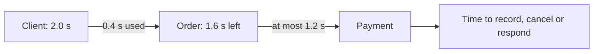

# Chapter 6: Architecture and distributed systems

Architecture determines where responsibilities, state and failure boundaries sit. Once part of a system runs elsewhere, communication can be delayed, duplicated or lost while other parts continue. Trustworthy systems make those boundaries and uncertain outcomes explicit.

The entries reuse a small order system so that the same request can cross a payment provider, a queue and several copies of data without implying that every project needs this shape. They define their working terms and link to relevant computing, programming, web and data ideas instead of requiring earlier chapters.

The focus is software structure and remote coordination. Language-level concurrency belongs in Chapter 2, database transactions in Chapter 5, deployment topology and managed infrastructure in [Chapter 7](07-infrastructure-cloud-and-delivery.md), operational objectives and recovery in Chapter 8, security controls in Chapter 9, and organisational architecture governance in Technical Leadership for Builders.

## Chapter map

The first pass covers:

1. [System context, boundaries, components and architecture views](#system-context-boundaries-components-and-architecture-views)
2. [Monoliths, services, and stateful and stateless components](#monoliths-services-and-stateful-and-stateless-components)
3. [Synchronous calls, asynchronous messages, queues, streams and events](#synchronous-calls-asynchronous-messages-queues-streams-and-events)
4. [Partial failure and the fallacies of distributed computing](#partial-failure-and-the-fallacies-of-distributed-computing)
5. [Deadlines, retries and safe repetition](#deadlines-retries-and-safe-repetition)
6. [Replication, partitioning, consistency and user-visible intermediate states](#replication-partitioning-consistency-and-user-visible-intermediate-states)
7. [Controlling overload and containing failure](#controlling-overload-and-containing-failure)

## System context, boundaries, components and architecture views

*An architecture view is a selective map for answering one question, not the system itself.*

### What they are

**Architecture** is the consequential structure of a system: which parts exist, what responsibilities and state they own, and how they depend on one another. A **system context** starts outside-in. It identifies the software system in scope, the people who use it and the external systems it depends on. Inside that boundary, **components** are parts with distinct responsibilities and relationships. A component might be a module, process or service; the useful level of detail depends on the question.

For an order system, a context view might show customers and staff using the system, plus payment and delivery providers outside it. A component view could then show the web application, order logic and data store. A request-sequence view would answer a different question: what happens when a customer places an order. A deployment view would show where those parts run. Combining every detail into one picture usually obscures all four questions.

[ISO/IEC/IEEE 42010:2022](https://www.iso.org/standard/74393.html) distinguishes a system's architecture from the description used to express it. The [C4 model](https://c4model.com/introduction) supplies one accessible vocabulary for zooming from context to components, but its own guidance is to use only the views that add value.

### Why a builder needs to know this

A useful view exposes dependencies, responsibility and change impact. It can reveal that a local-looking feature now depends on a remote provider, queue or background worker. This matters in artificial intelligence (AI)-assisted work because generated code and configuration can add such dependencies before the responsible builder has formed a model of them. The evidence should come from the code, configuration and deployed resources; a plausible diagram inferred from filenames is not proof of the running architecture.

### Pitfalls

- **“The diagram is the architecture.”** It is one model that can omit, simplify or become stale.
- **“A boundary is a repository.”** System, process, data-ownership and security boundaries may cut the codebase differently.
- **“More detail means more accuracy.”** Detail unrelated to the view's purpose makes consequential relationships harder to see.
- **“A named component has a coherent responsibility.”** The label states an intention; dependencies and change patterns provide evidence.

### Related concepts in TFB

- [Modularity, cohesion, coupling and separation of concerns](03-software-engineering.md#modularity-cohesion-coupling-and-separation-of-concerns) - architecture places module boundaries in a wider system.
- [Service APIs and behavioural contracts](04-internet-web-and-apis.md#service-apis-and-behavioural-contracts) - a remote boundary needs a behavioural contract, not only a connecting arrow.
- [Data models, schemas, identifiers and missing values](05-data-and-databases.md#data-models-schemas-identifiers-and-missing-values) - architecture must identify where important state and its meaning live.

### Deeper concepts

- Architecture viewpoints - selecting models for particular concerns and readers.
- Domain-driven design and bounded contexts - aligning software boundaries with distinct models and language.
- Dynamic and deployment views - showing runtime interactions and placement without overloading a structural view.

### Further reading

- [ISO/IEC/IEEE 42010:2022](https://www.iso.org/standard/74393.html) - the standard vocabulary for architecture descriptions, viewpoints and models.
- [C4 model introduction](https://c4model.com/introduction) - an outside-in method for context, container and component views.
- [C4 model diagram guidance](https://c4model.com/diagrams) - practical advice on choosing only useful views.

## Monoliths, services, and stateful and stateless components

*Moving a boundary across a network changes its costs and failure behaviour; it does not automatically improve the design.*

### What they are

A **monolith** packages several capabilities into one main deployable application. It can still have well-separated internal modules. A **service** is an independently running component reached through a remote interface. A useful service boundary may allow separate deployment, scaling or fault containment, but every remote boundary also adds latency, version compatibility, partial failure and operational work.

The order system could begin as one application containing catalogue, order and fulfilment modules. Separating fulfilment into a service may help if it has a genuinely different lifecycle or load. Splitting every table or function into its own service creates distribution without necessarily creating useful independence. Services that share one database, require co-ordinated releases or form long synchronous call chains can behave as a **distributed monolith**.

A **stateful component** depends on retained information or stable identity across operations. A **stateless component** can handle an operation without relying on process-local history from an earlier one, so equivalent instances can often replace each other. Stateless does not mean that the application has no state. A stateless web instance may read orders and sessions from a database; moving state elsewhere adds another dependency rather than making it disappear.

### Why a builder needs to know this

Frameworks and AI tools can generate another service and deployment file cheaply. The continuing cost is the runtime contract, state owner, failure path and operating surface. A split needs evidence that it improves a property the system actually requires. Martin Fowler's [Monolith First](https://martinfowler.com/bliki/MonolithFirst.html) records the boundary-discovery problem and service premium without claiming that one starting shape fits every system.

Kubernetes distinguishes interchangeable stateless workloads from workloads requiring stable identity in its current [workload documentation](https://kubernetes.io/docs/concepts/workloads/). This is a recognition example, not a recommendation; orchestration belongs in Chapter 7. Product terminology reviewed 2026-07-31.

### Pitfalls

- **“Monolith means tangled code.”** Deployment shape and internal modularity are different properties.
- **“A separate process is independent.”** Shared state, releases and synchronous dependencies can preserve tight coupling.
- **“Stateless means no durable state.”** The state usually sits behind another boundary.
- **“More services improve availability.”** More network calls and changing parts create more failure combinations unless a split also isolates them.

### Related concepts in TFB

- [Modularity, cohesion, coupling and separation of concerns](03-software-engineering.md#modularity-cohesion-coupling-and-separation-of-concerns) - good internal boundaries do not require network boundaries.
- [Transactions, atomicity, isolation and concurrency control](05-data-and-databases.md#transactions-atomicity-isolation-and-concurrency-control) - a database transaction does not automatically cross service boundaries.
- [Variables, state, mutability and side effects](02-programming-foundations.md#variables-state-mutability-and-side-effects) - state remains a responsibility wherever the architecture places it.

### Deeper concepts

- Modular monoliths - preserving strong internal boundaries inside one deployment.
- Microservices - independently deployable services organised around capabilities.
- Strangler migrations - replacing parts of a system gradually at an explicit boundary.

### Further reading

- [Martin Fowler: Monolith First](https://martinfowler.com/bliki/MonolithFirst.html) - boundary uncertainty and the operational premium of services.
- [Martin Fowler: Microservices](https://martinfowler.com/articles/microservices.html) - characteristics and trade-offs of the service style.
- [Kubernetes: Workloads](https://kubernetes.io/docs/concepts/workloads/) - a current implementation example of stateless replicas and stable workload identity.

## Synchronous calls, asynchronous messages, queues, streams and events

*Communication style determines which components must be available together and what the caller can know immediately.*

### What they are

In a **synchronous call**, the caller waits for a response or failure before continuing the dependent path. In **asynchronous messaging**, a producer hands off a message without requiring the final work to finish before it proceeds. The latter can separate availability and timing, but replaces an immediate answer with questions about hand-off durability, backlog, duplicates, order and eventual outcome.

A **queue** holds messages pending processing. Many brokered queues let consumers claim work and acknowledge completion, but removal and redelivery semantics vary. A queue can distribute tasks and absorb a short mismatch between production and consumption rates, but it cannot make capacity infinite. A **stream** is a continuing, often retained sequence of records that consumers can read at their own positions and sometimes replay. Ordering may apply only within a key or partition rather than across the whole stream.

An **event** records that something happened; a **command** asks for something to happen. In the order system, `OrderPlaced` describes a past fact, while `DispatchOrder` requests an action. Using event language does not remove authority or delivery questions. The [CloudEvents specification](https://github.com/cloudevents/spec/blob/main/cloudevents/spec.md) standardises common event metadata, not the business meaning or delivery guarantee.

### Why a builder needs to know this

The communication choice shapes both architecture and user experience. Checkout might synchronously request payment, then publish fulfilment work to a queue. “Payment accepted” and “fulfilment queued” are different evidence. An agentic workflow has the same issue when one user request fans out into model calls, tool calls and background jobs: a convincing response can coexist with unfinished or duplicated effects if the durable hand-offs and final owner are unclear.

RabbitMQ work queues and Apache Kafka streams are current product examples, reviewed 2026-07-31. Their documentation illustrates the categories; it does not make their guarantees interchangeable.

### Pitfalls

- **“Asynchronous means reliable.”** Publishing can fail, and accepted work may expire or remain queued.
- **“Acknowledged means complete.”** It proves only what the acknowledging layer's contract says.
- **“Exactly once describes the whole outcome.”** Delivery, processing and business effect need separate scopes.
- **“The queue preserves order.”** Parallel consumers, retries and partitions can narrow or change ordering.
- **“A queue absorbs any spike.”** Once consumers are saturated, waiting work and latency keep growing.

### Related concepts in TFB

- [Collections, data structures and algorithmic cost](02-programming-foundations.md#collections-data-structures-and-algorithmic-cost) - a runtime queue still has bounded storage and processing cost.
- [Service APIs and behavioural contracts](04-internet-web-and-apis.md#service-apis-and-behavioural-contracts) - message producers and consumers also need behavioural contracts.
- [Schema evolution, online migrations and backfills](05-data-and-databases.md#schema-evolution-online-migrations-and-backfills) - message schemas and consumers must coexist safely while changing.

### Deeper concepts

- Delivery guarantees and poison messages - defining what can repeat, fail permanently or need separate handling.
- Transactional outbox - publishing a message from a committed database change without pretending both are one transaction.
- Sagas and compensating actions - co-ordinating multi-system work whose completed steps cannot simply roll back.

### Further reading

- [RabbitMQ: Work Queues](https://www.rabbitmq.com/tutorials/tutorial-two-dotnet) - deferred work, acknowledgements, competing consumers and queue growth.
- [Apache Kafka: Introduction](https://kafka.apache.org/documentation/) - retained streams, consumers, partitions and ordering scope.
- [CloudEvents specification](https://github.com/cloudevents/spec/blob/main/cloudevents/spec.md) - a vendor-neutral event envelope and its deliberate limits.

## Partial failure and the fallacies of distributed computing

*Silence from a remote component does not reveal whether it did nothing, is still working or completed the effect.*

### What they are

A **partial failure** occurs when one part of a distributed operation fails or becomes unreachable while other parts continue. Suppose the order component asks a payment provider to charge a card, then waits without receiving a response. The request might have been lost, the provider might be slow, or the charge might have completed while the response was lost. The caller has an uncertain observation, not proof that the payment failed.

This is a fundamental difference between local and remote calls. Waldo, Wyant, Wollrath and Kendall's [*A Note on Distributed Computing*](https://scholar.harvard.edu/files/waldo/files/waldo-94.pdf) explains why latency, concurrency and partial failure cannot be hidden behind local-looking interfaces. Generated clients and natural-language tool wrappers can make a remote operation look especially ordinary, but `timed out` still says only how long one caller waited.

The **fallacies of distributed computing** make eight unsafe assumptions memorable. Four concern communication: that the network is reliable, latency is zero, bandwidth is infinite and the network is secure. Four concern its environment: that topology does not change, there is one administrator, transport costs nothing and the network is homogeneous. They are prompts for investigation, not claims that networks never work. L. Peter Deutsch gives first-person provenance and qualifications in [Software Engineering Radio episode 470](https://se-radio.net/2021/07/episode-470-l-peter-deutsch-on-the-fallacies-of-distributed-computing/).

### Why a builder needs to know this

After an uncertain payment result, the safe next step might be to query by operation identifier, retry an idempotent request, reconcile later or show the customer that confirmation is pending. Blindly repeating the effect can charge twice. A system already becomes distributed when an ordinary web application depends on a database and payment provider; this is not only a large-company concern.

### Pitfalls

- **“Timeout means failure.”** It means that one wait expired; remote work may have completed.
- **“The health check passed.”** It proves only that one check worked then, not that real requests succeed.
- **“Redundancy removes partial failure.”** Copies can share a dependency, bad change or overload path.
- **“The client library handles it.”** A wrapper cannot invent an idempotency-key contract or correct recovery semantics.
- **“The network is internal, so it is safe.”** Security assumptions require their own evidence and belong in Chapter 9.

### Related concepts in TFB

- [The journey of a request](04-internet-web-and-apis.md#the-internet-internet-protocol-transport-ports-and-the-journey-of-a-request) - a remote request crosses layers that can fail independently.
- [Errors, exceptions and cleanup](02-programming-foundations.md#errors-exceptions-and-cleanup) - a local error path does not automatically clean up remote effects.
- [Transactions, atomicity, isolation and concurrency control](05-data-and-databases.md#transactions-atomicity-isolation-and-concurrency-control) - a local transaction cannot make an external payment atomic with a database change.

### Deeper concepts

- Failure detection and grey failures - deciding whether a component is useful when evidence is incomplete.
- Reconciliation - comparing authoritative records after an uncertain or interrupted operation.
- Fault injection - testing system behaviour under selected dependency failures.

### Further reading

- [Waldo et al.: *A Note on Distributed Computing*](https://scholar.harvard.edu/files/waldo/files/waldo-94.pdf) - the original technical report on remote invocation and partial failure.
- [L. Peter Deutsch on the fallacies of distributed computing](https://se-radio.net/2021/07/episode-470-l-peter-deutsch-on-the-fallacies-of-distributed-computing/) - provenance and modern qualification of the classic eight fallacies.
- [Google SRE: Addressing Cascading Failures](https://sre.google/sre-book/addressing-cascading-failures/) - concrete ways dependency and overload failures spread.

## Deadlines, retries and safe repetition

*A finite operation needs one visible time budget; each wait and retry spends part of it.*

### What they are

A **deadline** is the point after which an overall result is no longer worth waiting for. A **timeout** bounds one wait or phase. With two seconds for checkout, the order component cannot spend the full two seconds waiting for payment and still have time to record or return an honest outcome. Each downstream call should receive the remaining budget rather than a fresh full allowance.

The diagram shows a shrinking end-to-end budget. Expiry at one layer does not automatically stop work or reverse effects elsewhere.

**Cancellation** asks abandoned work and its downstream calls to stop, but code must co-operate; it is not guaranteed interruption or rollback. A **retry** spends more time and capacity on another attempt. Bounded attempts, exponential backoff and random **jitter** can reduce the chance of clients retrying together, but retries at several layers can multiply one request into many. The [Amazon Builders' Library](https://aws.amazon.com/builders-library/timeouts-retries-and-backoff-with-jitter/) connects these mechanisms and their overload risk.

An operation is **idempotent** when repeating it has the same intended effect as doing it once within a defined scope. A server might record an **idempotency key** with a payment outcome and return that outcome for repeats. The receiving system must bind the key to the operation and matching parameters, then use one authoritative record to co-ordinate concurrent attempts; adding a key to a request changes nothing by itself. The key identifies a repeat, while the broader operation identity also includes its intended action and scope. This can protect an uncertain retry, but it does not make repeated work free or guarantee success. [Request for Comments (RFC) 9110](https://www.rfc-editor.org/rfc/rfc9110.html#section-9.2.2) defines idempotent Hypertext Transfer Protocol methods and limits when clients may retry automatically.

### Why a builder needs to know this

Defaults can be hidden in generated clients, gateways and software development kits while an outer agent loop retries again. Builders need one visible end-to-end budget, an inventory of retry layers and an explicit idempotency-key contract for repeatable effects. A timeout value is not a complete failure policy.

### Pitfalls

- **“Longer timeout means safer.”** It can hold scarce threads, connections and memory until the system overloads.
- **“Cancellation undoes the operation.”** It is a signal; completed effects require their own recovery semantics.
- **“Backoff solves retry storms.”** Without jitter, many clients can remain synchronised.
- **“Idempotent means identical response.”** It concerns intended effect within a scope; responses and repeated internal work may differ.
- **“The server remembers every operation forever.”** Keys have parameter, storage and retention boundaries that the contract must state.

### Related concepts in TFB

- [Latency and throughput](01-computing-foundations.md#latency-and-throughput) - time limits need a named operation and observation boundary.
- [Errors, exceptions and cleanup](02-programming-foundations.md#errors-exceptions-and-cleanup) - cancellation and expiry need explicit cleanup paths.
- [Data integrity](05-data-and-databases.md#constraints-validation-and-data-integrity) - a uniqueness rule can help enforce one idempotency key within its stated scope.

### Deeper concepts

- Deadline propagation and timeout ordering - preserving a shrinking budget through nested calls.
- Retry budgets and circuit breakers - limiting repeated demand while a dependency is impaired.
- Reconciliation and hedged requests - resolving uncertain outcomes or controlled duplicate attempts.

### Further reading

- [gRPC: Deadlines](https://grpc.io/docs/guides/deadlines/) and [cancellation](https://grpc.io/docs/guides/cancellation/) - maintained examples of propagation and co-operative stopping.
- [Amazon Builders' Library: Timeouts, retries and backoff with jitter](https://aws.amazon.com/builders-library/timeouts-retries-and-backoff-with-jitter/) - the production interaction between bounded waits and retry amplification.
- [RFC 9110: Idempotent methods](https://www.rfc-editor.org/rfc/rfc9110.html#section-9.2.2) - the protocol definition and retry qualification.
- [Stripe: Idempotent requests](https://docs.stripe.com/api/idempotent_requests) - a current idempotency-key implementation, reviewed 2026-07-31.

## Replication, partitioning, consistency and user-visible intermediate states

*When a system keeps several copies of state, the promises about which version a reader sees become product behaviour.*

### What they are

**Replication** maintains additional copies of state to improve locality, read capacity or availability. Copies need communication to stay aligned. A **network partition** is a period when groups of otherwise running components cannot communicate sufficiently to behave as one system. During delay or partition, different readers may observe different versions.

A **consistency model** describes the observations a system permits: whether a completed write must be visible to a later read, whether readers can temporarily see different versions and how concurrent writes are ordered. “Strong” and “eventual” name families of guarantees, not complete product requirements.

The consistency, availability and partition tolerance (**CAP**) result is often shortened misleadingly to “pick any two”. Its useful first-pass claim applies during a partition. A replicated data system then cannot guarantee both that every request to a non-failing component eventually gets a non-error response and that all operations behave as though they use one current copy. Gilbert and Lynch explain the theorem's scope in [*Perspectives on the CAP Theorem*](https://groups.csail.mit.edu/tds/papers/Gilbert/Brewer2.pdf). This consistency is also different from **atomicity, consistency, isolation and durability (ACID) consistency**, which means that a committed database transaction preserves valid-state rules.

### Why a builder needs to know this

The order system might write through one component while a status screen reads from a lagging copy or search index. Honest states include **processing**, **accepted but not yet visible in every view**, **awaiting payment confirmation**, **conflict requiring action** and **temporarily unavailable**. Showing stale data as final truth, or reporting success before the promised state is durable, turns a technical choice into a product defect.

The same matters when an agent reads stale state and then issues a conflicting write. Better prompting cannot supply a missing freshness guarantee; the operation contract must identify the authoritative state source and acceptable staleness.

### Pitfalls

- **“Replication is backup.”** Copies can reproduce deletion, corruption or a bad write.
- **“Eventual consistency means random forever.”** Convergence, conflict and read guarantees still need precise bounds.
- **“CAP availability means percentage uptime.”** It has a technical meaning for responses during a partition.
- **“More replicas improve every property.”** They can increase coordination, cost, lag and conflict paths.
- **“Committed means globally visible.”** A local durable write and visibility from every reader are different milestones.

### Related concepts in TFB

- [Transactions, atomicity, isolation and concurrency control](05-data-and-databases.md#transactions-atomicity-isolation-and-concurrency-control) - ACID valid-state consistency is not a replica-read guarantee.
- [Non-relational databases, consistency and the data lifecycle](05-data-and-databases.md#non-relational-databases-consistency-and-the-data-lifecycle) - storage categories do not determine one universal consistency model.
- [Service APIs and behavioural contracts](04-internet-web-and-apis.md#service-apis-and-behavioural-contracts) - freshness and intermediate states are part of observable behaviour.

### Deeper concepts

- Consensus, leader election and quorums - agreeing on ordered state across independently failing components.
- Read-your-writes and causal consistency - consistency models tied to a user's or operation's prior observations.
- Partition: availability or consistency; else: latency or consistency (PACELC) - considering latency and consistency trade-offs during ordinary operation as well as partitions.

### Further reading

- [Gilbert and Lynch: *Perspectives on the CAP Theorem*](https://groups.csail.mit.edu/tds/papers/Gilbert/Brewer2.pdf) - theorem scope and practical interpretation from the proof's authors.
- [Amazon DynamoDB: Read consistency](https://docs.aws.amazon.com/amazondynamodb/latest/developerguide/HowItWorks.ReadConsistency.html) - a current example of operation- and topology-specific guarantees, reviewed 2026-07-31.
- [Apache Kafka: Introduction](https://kafka.apache.org/documentation/) - a current example of replication and per-partition ordering, reviewed 2026-07-31.

## Controlling overload and containing failure

*Finite systems remain useful under stress by controlling work before waiting and retries consume all capacity.*

### What they are

A **load balancer** chooses among eligible workers using some combination of routing, health and load information. It can spread uneven demand and avoid an evidently failed worker, but it does not create capacity. Moving work away from one worker can overload the survivors.

**Admission control** rejects or defers work before it consumes more scarce resources. A **rate limit** bounds use over time or by client, operation or product. A **bounded queue** caps waiting work so that overload becomes an explicit rejection or drop policy rather than unbounded memory and delay. **Backpressure** communicates downstream capacity towards producers so they slow, pause or fail early.

**Overload collapse** is a feedback loop in which useful throughput falls as demand rises. Slow work increases in-flight requests and queues; deadlines expire after expensive work; clients retry; and the remaining workers receive still more load. The [Google Site Reliability Engineering account of cascading failures](https://sre.google/sre-book/addressing-cascading-failures/) connects these mechanisms and explains why early rejection can preserve useful capacity.

A **failure domain** is a group likely to fail together because it shares a dependency, deployment, region, configuration or change path. Redundancy helps only when the copies do not share the cause being protected against. **Graceful degradation** deliberately provides a smaller, cheaper but honest outcome—such as orders without recommendations—when an optional dependency is impaired.

### Why a builder needs to know this

One user request can fan out into several service, model and tool calls, each with its own concurrency and retry behaviour. Total tool-call budgets, bounded work queues, cancellation and per-provider limits therefore belong to the architecture of an agentic system. Without them, one slow dependency can turn a stalled request into a capacity and cost cascade.

### Pitfalls

- **“An unbounded queue absorbs load.”** It converts excess demand into growing delay and memory use.
- **“The edge rate limit controls total work.”** Fan-out and expensive operations can amplify load deeper in the system.
- **“Autoscaling will catch up.”** Scaling is delayed and may depend on an impaired control plane.
- **“Healthy replicas are independent.”** They may share the same database, region, configuration or deployment fault.
- **“Degraded means any result is better than failure.”** Skipping authorisation or returning corrupt data is not graceful degradation.

### Related concepts in TFB

- [Latency and throughput](01-computing-foundations.md#latency-and-throughput) - finite capacity links offered load, queueing delay and completed work.
- [Collections, data structures and algorithmic cost](02-programming-foundations.md#collections-data-structures-and-algorithmic-cost) - queues and work amplification consume finite memory and processing.
- [The journey of a request](04-internet-web-and-apis.md#the-internet-internet-protocol-transport-ports-and-the-journey-of-a-request) - routing a request does not guarantee that the selected application can accept it.

### Deeper concepts

- Load shedding, circuit breakers and bulkheads - stopping impaired work and containing resource exhaustion.
- Queueing theory - relating arrival rate, service time, concurrency, wait and saturation.
- Cells and static stability - isolating failure and preserving pre-provisioned capacity without a working control plane.

### Further reading

- [Google SRE: Load Balancing in the Datacenter](https://sre.google/sre-book/load-balancing-datacenter/) - routing work across backends and the limits of health information.
- [Google SRE: Addressing Cascading Failures](https://sre.google/sre-book/addressing-cascading-failures/) - bounded queues, load shedding, retry amplification and graceful degradation.
- [Reactive Streams](https://www.reactive-streams.org/) - a vendor-neutral specification effort centred on bounded buffering and backpressure.
- [Amazon Builders' Library: Static stability using Availability Zones](https://aws.amazon.com/builders-library/static-stability-using-availability-zones/) - one current fault-isolation and pre-provisioned-capacity design, reviewed 2026-07-31.

[Return to the guide map](../README.md#map-of-the-territory) · [Browse the complete Chapter 6 plan](../OUTLINE.md#6-architecture-and-distributed-systems)
